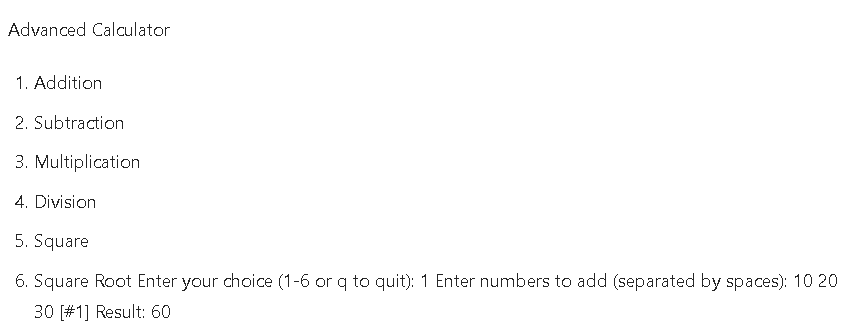

# README for Calculator App in Java

This document provides a detailed explanation of the **Calculator App** implemented in Java. The app is designed to perform basic arithmetic operations such as addition, subtraction, multiplication, division, square, and square root. 

Below is the breakdown of the code structure, functionality, and usage instructions.

---

## **Project Structure**
The project consists of two main classes:
1. **`Operations`**: Contains static methods for performing arithmetic operations.
2. **`Main`**: Handles user interaction, input validation, and result display.

---

## **Key Features**
1. **Modular Design**: The app is divided into two classes for better organization and reusability.
2. **Input Validation**: Ensures that user inputs are valid and handles edge cases (e.g., division by zero, negative square roots).
3. **Dynamic Operations**: Supports operations on multiple numbers (addition and multiplication).
4. **User-Friendly Interface**: Provides a clear menu and prompts for user input.
5. **Error Handling**: Catches and displays meaningful error messages for invalid inputs or operations.

---

## **Code Explanation**

### **1. `Operations` Class**
This class contains static methods for performing arithmetic operations. Each method is designed to handle specific edge cases and throw appropriate exceptions.

#### **Methods**
- **`add(double... numbers)`**:  
  Adds multiple numbers. Throws an `IllegalArgumentException` if the input is null or empty.
- **`subtract(double num1, double num2)`**:  
  Subtracts `num2` from `num1`.
- **`multiply(double... numbers)`**:  
  Multiplies multiple numbers. Throws an `IllegalArgumentException` if the input is null or empty.
- **`divide(double num1, double num2)`**:  
  Divides `num1` by `num2`. Throws an `ArithmeticException` if `num2` is zero.
- **`square(double num)`**:  
  Returns the square of `num`.
- **`squareRoot(double num)`**:  
  Returns the square root of `num`. Throws an `IllegalArgumentException` if `num` is negative.

---

### **2. `Main` Class**
This class handles user interaction, input validation, and result display. It uses a `Scanner` object to read user input and a loop to keep the app running until the user chooses to quit.

#### **Key Components**
- **`main(String[] args)`**:  
  The entry point of the app. Displays the menu, processes user input, and calls the appropriate operation methods.
- **`readMenuChoice()`**:  
  Displays the menu and reads the user's choice. Ensures the input is valid (1-6 or 'q' to quit).
- **`printResult(double value)`**:  
  Displays the result of the operation in a formatted manner.
- **Operation Methods (`doAddition()`, `doSubtraction()`, etc.)**:  
  Handle the logic for each operation, including input prompts and result display.
- **Input Validation Methods (`readDouble()`, `readDoubles()`)**:
  Ensure that user inputs are valid numbers and handle invalid inputs gracefully.

---

## **Usage Instructions**
1. **Run the Program**:  
   Compile and run the `Main` class to start the calculator app.
2. **Choose an Operation**:  
   The app will display a menu of available operations. Enter the corresponding number (1-6) to select an operation or 'q' to quit.
3. **Provide Inputs**:  
   Follow the prompts to enter the required numbers. For operations like addition and multiplication, you can enter multiple numbers separated by spaces.
4. **View Results**:  
   The app will display the result of the operation in a formatted manner.
5. **Quit the App**:  
   Enter 'q' at any time to exit the app.

---

## **Error Handling**
The app is designed to handle common errors gracefully:
- **Invalid Inputs**: If the user enters an invalid number or choice, the app will prompt them to try again.
- **Edge Cases**:
    - Division by zero is not allowed.
    - Square roots of negative numbers are not allowed.
    - Empty or null inputs for addition and multiplication are not allowed.

---

## **Example Workflow**

